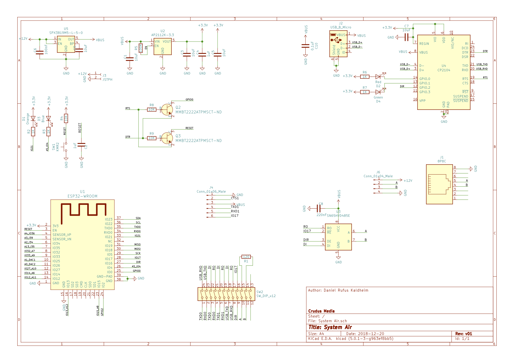

# System Air ESP32 Bridge

Inspired from [Airiana](https://github.com/BeamCtrl/Airiana).

// Todo: write detailed README

Check out the [bom](https://htmlpreview.github.io/?https://raw.githubusercontent.com/danielkaldheim/systemair-esp32-bridge/master/ibom.html).

The PCB-board is inspired by [Crudus Sense](https://kaldheim.org/projects/crudus-sense) project (which is a work in progress). Also the code share same library.




## Home assistant

MQTT configuration for [Climate HVAC](https://www.home-assistant.io/integrations/climate.mqtt/).

configuration.yaml:

```yaml
climate:
    - platform: mqtt
    name: VR400
    unique_id: "SystemAir-68E6"
    modes:
        - "off"
        - "heat"
        - "fan_only"
    mode_command_topic: systemair/68E6/mode/set
    mode_state_topic: systemair/68E6/mode/state
    fan_modes:
        - "off"
        - "low"
        - "medium"
        - "high"
    fan_mode_state_topic: systemair/68E6/fan/state
    fan_mode_command_topic: systemair/68E6/fan/set
    current_temperature_template: "{{ value_json.extract }}"
    temperature_command_topic: systemair/68E6/temperature/set
    current_temperature_topic: systemair/68E6/temperature/state
```
